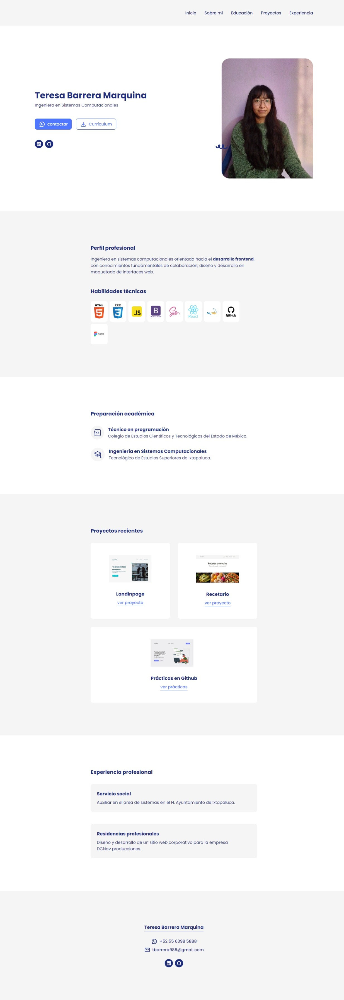
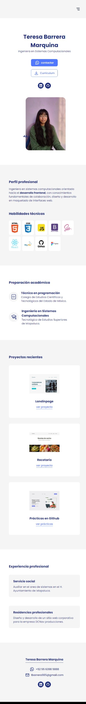

# Portafolio web Teresa Barrera Marquina

### Descripción:
Portafolio web que incluye datos importantes como perfil profesional, formación académica, experiencia profesional y proyectos recientes.La interfaz web se diseño con la herramienta figma adaptado a medidas responsive y el maquetado web con html y css.

**Vista previa del proyecto:**

**Tamaño Desktop:**

**Visualización en tamaño Movil:**

### Recursos
* Fuente en [Google Fonts](https://fonts.google.com/)
* Diseño en [Figma](https://www.figma.com/)
* Iconos en [tabler icons](https://tabler.io/icons)